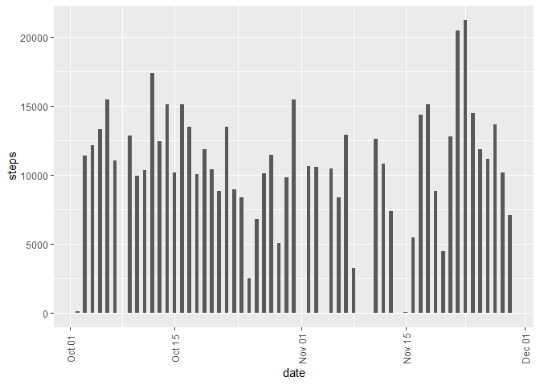
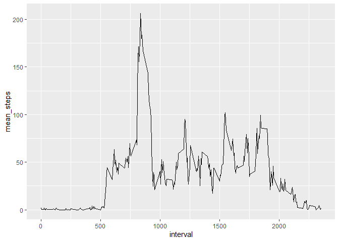
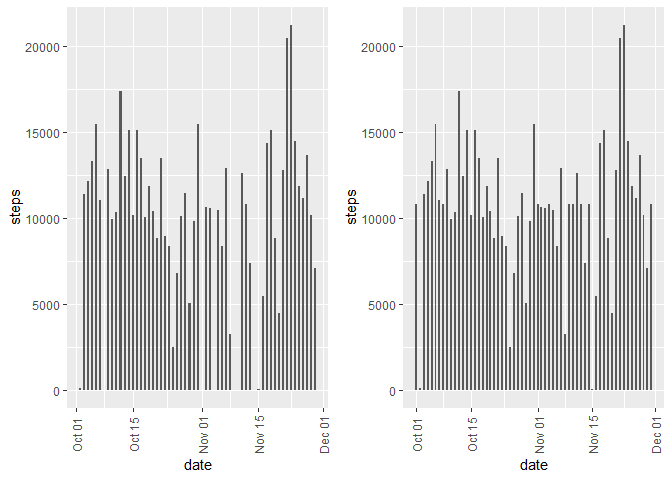

## Loading and preprocessing the data
### Load packages

### Download data and unzip folder

```r
url<-"https://d396qusza40orc.cloudfront.net/repdata%2Fdata%2Factivity.zip"
zipfile<- "repdata_data_activity.zip"
file<- "activity.csv"
if (!file.exists(zipfile)){
        download.file(url, zipfile, mode = "wb")
}
if (!file.exists(file)){
        unzip(zipfile)
}
```
### 1.Load the data

```r
dataset<-read.csv(file)
```
### 2.Process data

```r
dataset$date<-as.Date(dataset$date)
df<-na.omit(dataset)
```

## What is mean total number of steps taken per day?
### 1.Make a histogram of the total number of steps taken each day

```r
stepxday<-df%>%group_by(date)%>%summarise(steps=sum(steps))
g_stepxday<- ggplot(stepxday, aes(date,steps)) + 
        geom_col(width = 0.5)+
        theme(axis.text.x = element_text(angle = 90, vjust = 0.5))
print(g_stepxday)
```

<!-- -->

### 2.Calculate and report the mean and median total number of steps taken per day

```r
mean(stepxday$steps)
```

```
## [1] 10766.19
```

```r
median(stepxday$steps)
```

```
## [1] 10765
```

## What is the average daily activity pattern?
### 1.Make a time series plot of the 5-minute interval (x-axis) and the average number of steps taken, averaged across all days (y-axis)

```r
stepxint<-with(df,tapply(steps, interval, mean))
stepxint<-as_tibble(as.data.frame(as.table(stepxint)))
colnames(stepxint)<-c("interval","mean_steps")
stepxint$interval<-as.numeric(as.character(stepxint$interval))
g_stepxint<-ggplot(stepxint,aes(interval,mean_steps))+geom_line()
print(g_stepxint)
```

<!-- -->

### 2.Which 5-minute interval, on average across all the days in the dataset, contains the maximum number of steps?

```r
max_stp_int<-stepxint%>%arrange(desc(mean_steps))
max_stp_int[1,]
```

```
## # A tibble: 1 x 2
##   interval mean_steps
##      <dbl>      <dbl>
## 1      835       206.
```

## Imputing missing values
### 1.Calculate and report the total number of missing values in the dataset (i.e. the total number of rows with NAs

```r
sum(is.na(dataset))
```

```
## [1] 2304
```

### 2.Filling in all of the missing values in the dataset: the mean of that 5-minute interval

```r
narows<-is.na(dataset$steps)
df2<-dataset
df2$date<-as.Date(df2$date)
for (i in which(narows==TRUE)){
        int<- dataset[i,3]
        mean_steps<-stepxint[stepxint$interval==int,2]
        df2[i,1]<-mean_steps
}
```

### 4.Make a histogram of the total number of steps taken each day

```r
stepxday2<-df2%>%group_by(date)%>%summarise(steps=sum(steps))
g_stepxday2<- ggplot(stepxday2, aes(date,steps)) + 
        geom_col(width = 0.5)+
        theme(axis.text.x = element_text(angle = 90, vjust = 0.5))
print(g_stepxday2)
```

<!-- -->

### 4.Calculate and report the mean and median total number of steps taken per day

```r
mean(stepxday2$steps)
```

```
## [1] 10766.19
```

```r
median(stepxday2$steps)
```

```
## [1] 10766.19
```

```r
grid.arrange(g_stepxday,g_stepxday2,ncol=2)
```

<!-- -->

## Are there differences in activity patterns between weekdays and weekends?
### 1.Create a new factor variable in the dataset with two levels -- "weekday" and "weekend"

```r
days<- c(character())
days<-weekdays(df2[,2])
for (i in 1:length(days)){
        if (days[i]=="Saturday"|days[i]=="Sunday"){
                days[i]<-"weekend"
        }
        else {
                days[i]<-"weekday"
        } 
}
days<-as.factor(days)
df3<-cbind(df2,days)
```

### 2.Make a panel plot containing a time series plot

```r
ind<-with(df3,list(interval,days))
stepxint2<-with(df3,tapply(steps, ind, mean))
stepxint2<-as_tibble(as.data.frame(as.table(stepxint2)))
colnames(stepxint2)<-c("interval","days","mean_steps")
stepxint2$interval<-as.numeric(as.character(stepxint2$interval))

##Plot
xyplot(mean_steps~interval|days,data=stepxint2,type="l",
       ylab = "Number of steps",layout=c(1,2))
```

<!-- -->
